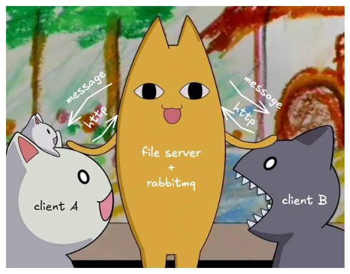

# Necoconeco

Necoconeco is a distributed file synchronization system for markdown files inspired by Obsidian Sync. It uses RabbitMQ for real-time messaging and HTTP for file operations. The system consists of a file server and multiple clients that can sync files and modifications in real-time.

This project was developed as an educational vehicle to explore distributed systems, concurrency, and message queues. This tool is not intended for production use.

## Build, Setup, and Development Commands

### Building the Applications

```bash
# Build server (requires 'server' build tag)
go build -tags server -o server server.go

# Build client (requires 'client' build tag)  
go build -tags client -o client client.go

# Build sync client (requires 'clientsync' build tag)
go build -tags clientsync -o clientsync clientsync.go
```

### Production Setup

1. **Server**
```bash
curl -L https://github.com/echo4eva/necoconeco/releases/download/server-release.tar.gz
tar -xzvf server-release.tar.gz
cd server-release
# NOTE: edit/create .env, rabbitmq.conf, or docker-compose.yml 
docker compose up
```

2. **Client**:
   Startup and run scripts for both operating systems are included
```bash
curl -L https://github.com/echo4eva/necoconeco/releases/download/linux-release.tar.gz
tar -xzvf linux-release.tar.gz
cd linux-release
# NOTE: edit config.json
sh run.sh
```

### Running Tests

```bash
# Run integration tests
go test ./integration_test/... -v
```

### Development Setup

```bash
# Start with Docker Compose for development
docker-compose -f ./integration_test/docker-compose.dev.yml
```

## Architecture Overview

### Core Components



1. **Server (`server.go`)**: Central file server that handles HTTP API requests and publishes events to RabbitMQ
   - Serves files via HTTP file server
   - Handles upload, directory creation, rename, and remove operations
   - Publishes sync events to RabbitMQ exchange
   - Processes client snapshots for synchronization

2. **Client (`client.go`)**: Real-time file watcher that syncs local changes to server
   - Watches filesystem for changes using fsnotify
   - Implements write debouncing to prevent excessive sync operations
   - Consumes RabbitMQ messages for remote changes
   - Handles bidirectional file synchronization

3. **Client Sync (`clientsync.go`)**: Initial synchronization client
   - Compares local and server snapshots
   - Performs bulk sync operations on startup
   - Creates directory snapshots for state tracking

### Key Packages

- `internal/api/`: HTTP API client and request/response types
- `internal/utils/`: File operations, metadata handling, and utility functions
- `internal/config/`: Used to load .env or config
- `integration_test/`: Comprehensive integration tests using testcontainers

### Synchronization Logic

The system uses a Last-Write-Wins (LWW) conflict resolution strategy with tombstones for deletions. File metadata includes timestamps and content hashes for conflict detection.

### Environment Configuration

Required environment variables (config.json or .env):

- `CLIENT_ID`: Unique identifier for each client
- `SYNC_DIRECTORY`: Local directory to sync
- `RABBITMQ_ADDRESS`: RabbitMQ connection string
- `RABBITMQ_EXCHANGE_NAME`: Exchange name for messaging
- `RABBITMQ_ROUTING_KEY`: Routing key for messages
- `RABBITMQ_QUEUE_NAME`: Queue name for client (client only)
- `SYNC_SERVER_URL`: HTTP URL of the file server
- `PORT`: Server port (server only)

## Development Notes

- Build tags are used to compile different binaries from the same codebase
- The system only syncs markdown (.md) files
- Integration tests use testcontainers for realistic testing with RabbitMQ and Docker
- Windows compatibility is supported via batch scripts and cross-platform file operations
